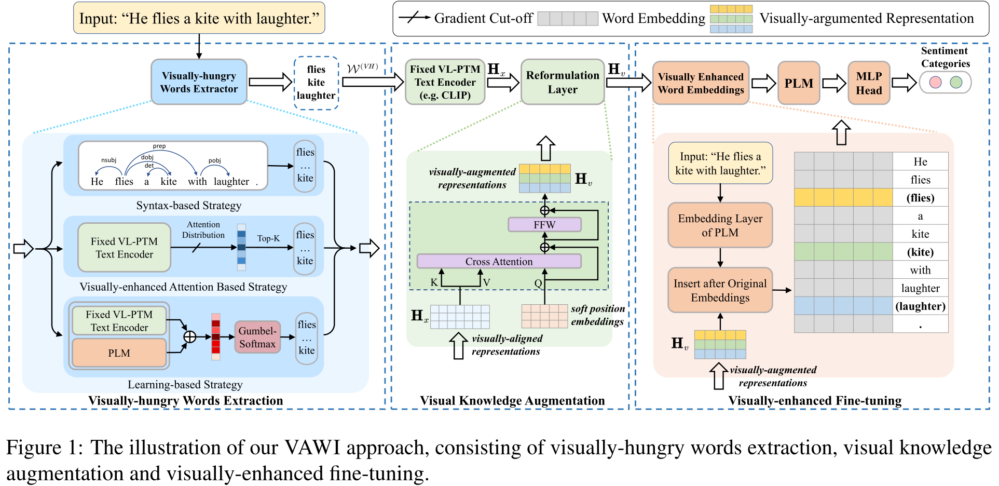

## Visually-augmented Pretrained Language Models for NLP Tasks without Images

This repository contains the code for our paper ***Visually-augmented Pretrained Language Models for NLP Tasks without Images***.

## Overview

We propose *VAWI* ([paper](https://arxiv.org/abs/2212.07937)), a visually-augmented fine-tuning approach applicable to various pre-trained language models (PLMs) and NLP tasks, without the need for retrieved or generated images. To mitigate the lack of visual semantics and commonsense in PLMs, we identify and extract visually-hungry words (VH-words) in the input text using three strategies. Then, we adopt a fixed CLIP text encoder to generate the visually-augmented representations of these VH-words. Finally, the visually-augmented representations will be fused and transformed into the pre-designed visual prompts based on VH-words, which can be inserted into PLMs to enrich the visual semantics in word representations.



## News

## Train VAWI

## Citation

Please cite our paper if you use VAWI in your work:

```bibtex
@article{guo2022visually,
  title={Visually-augmented pretrained language models for NLP tasks without images},
  author={Guo, Hangyu and Zhou, Kun and Zhao, Wayne Xin and Zhang, Qinyu and Wen, Ji-Rong},
  journal={arXiv preprint arXiv:2212.07937},
  year={2022}
}
```
